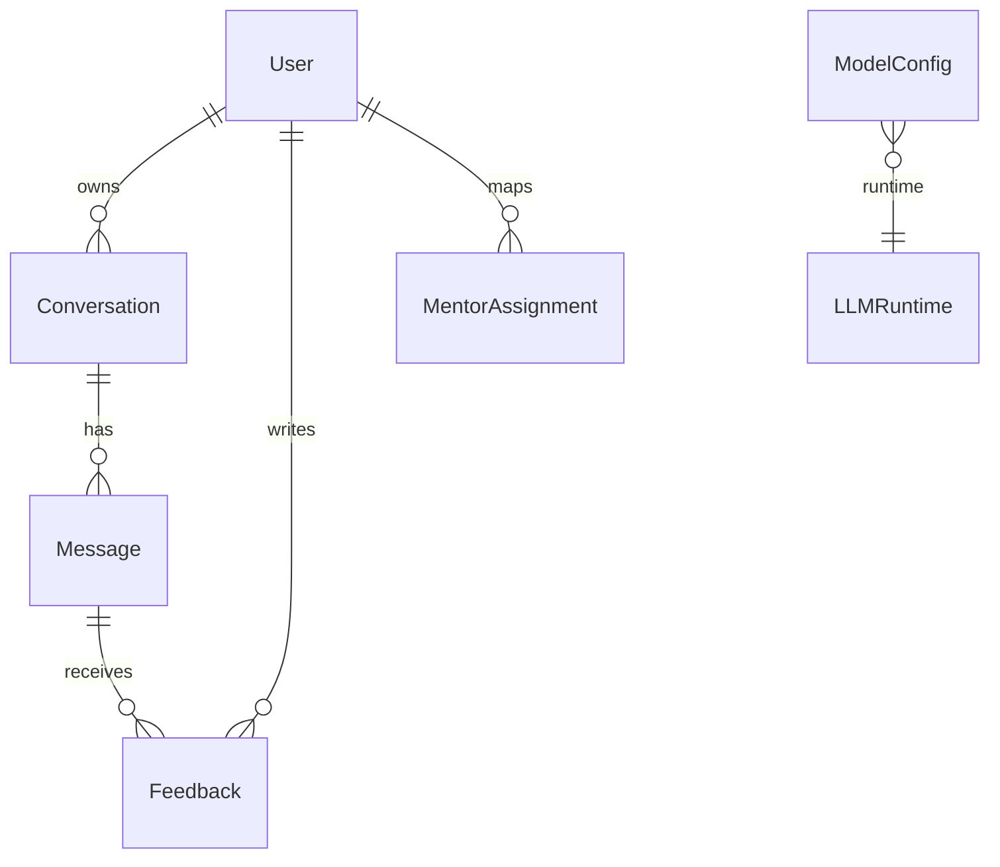
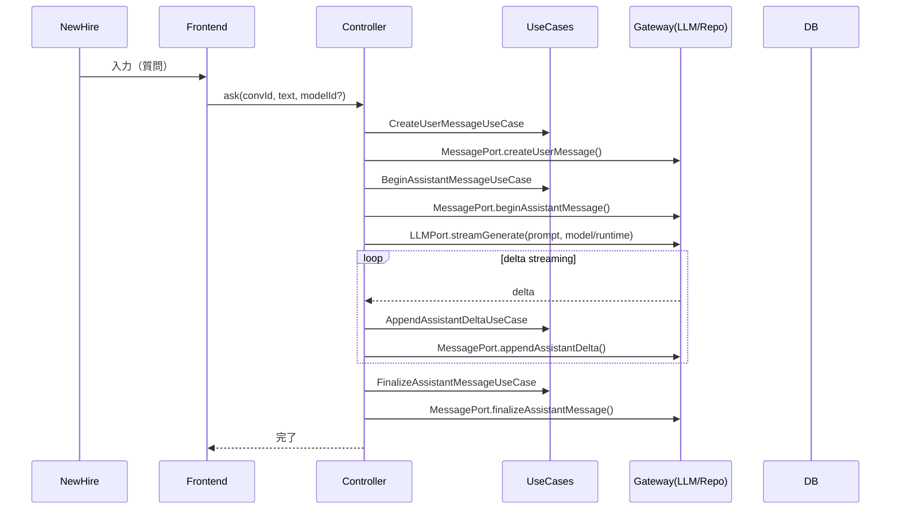
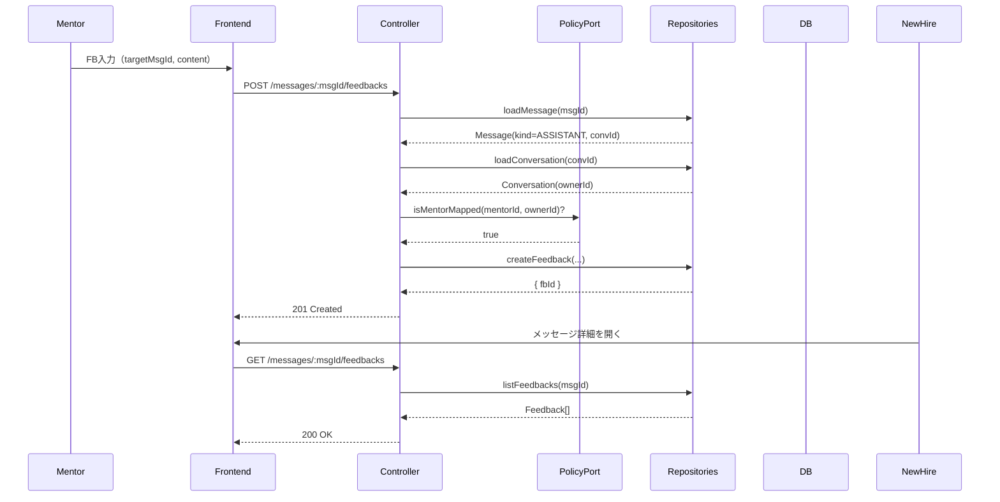

了解です。プロジェクトに同梱された**アーキテクチャ関係の文書**（`ARCHITECTURE_GUIDELINES.md` / `framework-presenter-view.md` / `controller.md` / `ui-event-adapter.md` / `viewmodel-presenter.md` / `gateway.md` / `error-handling.md` / `cross-cutting.md` / `usecase.md` / `domain.md`）の前提を踏まえ、記法と責務を統一した **統合仕様書（SPEC.md）** を再生成します。
（TypeScript + Next.js App Router、Clean Architecture 準拠）

---

# CHOI 就活最終課題 — 統合仕様書 (SPEC)

> 本仕様は同梱ドキュメントの原則に準拠：
>
> - レイヤ責務分離：**UI(View) / Interface Adapters(Controller, Presenter, UI Event Adapter, Gateway) / Application(UseCase) / Domain(Entities) / Infrastructure**
> - 依存は常に**内向き**、副作用は**Gateway**に隔離
> - Presenter ＝**派生値**と**制御フラグ**、UseCase/Domain ＝**純粋関数**、Controller ＝**最小状態**
> - エラー/例外とクロスカッティング関心（ロギング・レート制限・認証・監査）は明示

---

## 0. 目的

新入社員（NH）とメンター（MT）の**Mentor-in-the-loop**学習支援。
NH が質問 → LLM が**ストリーミング**応答 → MT が**フィードバック**。
将来、リモート LLM → **ローカル LLM へ切替**できる実行基盤の抽象化（`ModelConfig`×`LLMRuntime`）を備える。

---

## 1. スコープ（MVP）

- NH：質問投稿、会話履歴・応答ストリームの閲覧
- MT：回答に対するフィードバック作成・閲覧
- 会話アーカイブ（`ACTIVE/ARCHIVED`）
- **ストリーミング耐障害性**：途中まで（`PARTIAL`）でも保存・再開可
- **モデル切替**：`ModelConfig`（何を）× `LLMRuntime`（どこで/どう）で**リモート/ローカル**を差し替え

---

## 2. アーキテクチャ全体像

```
UI (Next.js App Router / View)
  └─ Interface Adapters
       ├─ Controller        … 入力の正規化・UseCase呼び出し・最小状態保持
       ├─ Presenter / ViewModel … 派生値・制御フラグ（純粋）
       ├─ UI Event Adapter  … DOM/Pointer/Keyboard → ドメインデータ化
       └─ Gateway           … HTTP/LLM/DB/Blob 等の副作用と例外制御の境界
  └─ Application (UseCase)  … 状態決定（純粋関数）
  └─ Domain (Entities)      … 不変条件・状態遷移（純粋）
  └─ Infrastructure         … Prisma/DB/外部API 等（Port実装）
```

- **SSR/CSR 使い分け**

  - SSR（Server Components）：会話一覧、直近メッセージの初期レンダリング
  - CSR（Client Components）：質問入力、**ストリーム描画**、フィードバック投稿 UI

- **API 境界**：Next.js Route Handlers（`/app/api/*`）→ Controller → UseCase → Port（Repo/LLM）

---

## 3. ドメイン（Entities）

### 3.1 一覧と責務

| Entity               | 要約                                                                                              |
| -------------------- | ------------------------------------------------------------------------------------------------- |
| **User**             | 行為主体（`NEW_HIRE`/`MENTOR`/`ADMIN`）。`email`は一意、`disabledAt`で論理停止。                  |
| **MentorAssignment** | MT↔NH の担当リンク。複合 PK（`mentorId,newhireId`）/ `revokedAt`で論理解除・履歴保持。            |
| **Conversation**     | NH 所有の会話スレッド。`state=ACTIVE/ARCHIVED`、`lastActiveAt`で並び替え。                        |
| **Message**          | 会話の発話。`NEW_HIRE`は即時完成、`ASSISTANT`はストリーミング（`DRAFT→PARTIAL→DONE/CANCELLED`）。 |
| **Feedback**         | **ASSISTANT** メッセージに対するコメント（主に MT）。                                             |
| **LLMRuntime**       | 実行環境（`remote`/`local`・`adapter`・`endpoint`・ローカルモデルの`modelPath`等）。              |
| **ModelConfig**      | モデル選択とパラメータ（`name`・`params`・`isDefault`）＋`runtimeId`で実行先を参照。              |

### 3.2 状態機械（抜粋）

- Conversation：`ACTIVE ↔ ARCHIVED`（`ACTIVE`時のみ`lastActiveAt`を更新）
- Message(ASSISTANT)：

  ```
  DRAFT → PARTIAL（最初のデルタ）
  PARTIAL → PARTIAL（追加デルタ）
  PARTIAL → DONE（finalize）
  DRAFT/PARTIAL → CANCELLED（中断）
  ```

### 3.3 ER（概要）



---

## 4. ユースケース（Application）

### 4.1 新入社員（NH）

| UseCase                           | 目的                 | 入力                       | 出力                   | Ports            |
| --------------------------------- | -------------------- | -------------------------- | ---------------------- | ---------------- |
| CreateUserMessageUseCase          | NH の質問を保存      | `convId, content`          | `{msgId}`              | MessagePort      |
| BuildPromptForConversationUseCase | 履歴圧縮＋安全化     | `convId, question, window` | `Prompt`               | PolicyPort(任意) |
| StreamAssistantAnswerUseCase      | LLM 実行・デルタ受信 | `prompt, modelId?`         | `AsyncIterable<delta>` | LLMPort          |
| ListConversationMessagesUseCase   | 1 会話の一覧         | `convId, cursor?, limit?`  | `{items, nextCursor?}` | MessagePort      |
| ListMessageFeedbacksUseCase       | FB 一覧              | `msgId, cursor?, limit?`   | `{items, nextCursor?}` | FeedbackPort     |

### 4.2 ストリーミング補助

| UseCase                         | 目的         | 入力                  | 出力        | Ports       |
| ------------------------------- | ------------ | --------------------- | ----------- | ----------- |
| BeginAssistantMessageUseCase    | DRAFT 作成   | `convId`              | `{msgId}`   | MessagePort |
| AppendAssistantDeltaUseCase     | PARTIAL 反映 | `msgId, delta, seqNo` | `{ok:true}` | MessagePort |
| FinalizeAssistantMessageUseCase | DONE 確定    | `msgId, finalText`    | `{ok:true}` | MessagePort |

### 4.3 メンター（MT）

| UseCase                      | 目的                 | 入力                             | 出力                   | Ports                   |
| ---------------------------- | -------------------- | -------------------------------- | ---------------------- | ----------------------- |
| ValidateFeedbackRulesUseCase | 対象/権限/形式の検証 | `targetMsgId, authorId, content` | `ValidatedFeedback`    | MessagePort, PolicyPort |
| CreateFeedbackUseCase        | FB 保存              | `targetMsgId, authorId, content` | `{fbId}`               | FeedbackPort            |
| ListMessageFeedbacksUseCase  | FB 一覧              | `msgId, cursor?, limit?`         | `{items, nextCursor?}` | FeedbackPort            |

**権限要点**（PolicyPort）

- NH：`isOwner(userId, convId)` が真
- MT：`isMentorMapped(mentorId, ownerId)` が真

---

## 5. ポート/アダプタ（Interface Adapters & Infra）

### 5.1 Ports（契約）

- **MessagePort**：作成・増分・確定・一覧
- **FeedbackPort**：作成・一覧
- **LLMPort**：`streamGenerate({prompt, model:{name,params}, runtime}) → AsyncIterable<delta>`
- **PolicyPort**：`isOwner`, `isMentorMapped`, `canCreateFeedback`

### 5.2 Adapters（実装例）

- **PrismaMessageRepository / PrismaFeedbackRepository**（DB）
- **GeminiAdapter / OpenAIAdapter / LlamaCppAdapter / VllmAdapter**（LLM）
- **RlsPolicyAdapter**（行レベル権限制御/RLS）
- **StreamGateway**（LLM 呼び出し・ストリーム購読・キャンセル・リソース解放）

---

## 6. Next.js 実装指針（App Router）

```
app/
  (logged-in)/chat/[convId]/page.tsx           // 初期SSR + CSRマウント
  api/ask/route.ts                             // Route Handler → Controller
interfaceAdapters/
  controllers/useConversationController.ts
  presenters/useConversationPresenter.ts
  adapters/useChatPointerAdapter.ts            // UI Event Adapter
  gateways/useChatStreamGateway.ts             // LLM/Blob/WS 等
application/
  chat/useCases.ts                             // 純粋関数のみ
domain/
  chat/**                                      // 不変条件・状態遷移
types/
  core.ts
```

- **Controller**：Route Handler から呼ばれ、UseCase をまとめて指揮（副作用なし）
- **Presenter**：ViewModel を計算（派生値・制御フラグ）
- **UI Event Adapter**：UI 由来の生データをドメイン入力へ正規化
- **Gateway**：LLM/HTTP/Blob/WebSocket の**唯一の**副作用点（エラー・キャンセル・クリーンアップ）

---

## 7. API（境界の最小セット：例）

- `POST /api/ask` — 入力 `{ convId, text, modelId? }` → ストリーム開始（Server-Sent/Fetch Stream）
- `GET /api/conversations/:convId/messages?cursor&limit`
- `GET /api/messages/:msgId/feedbacks?cursor&limit`
- `POST /api/messages/:msgId/feedbacks`

> Route Handler → Controller → UseCase → Ports（Repo/LLM）

---

## 8. データベース（DDL 概略 / PostgreSQL）

```sql
-- user
create table "user" (
  user_id uuid primary key,
  role text not null check (role in ('NEW_HIRE','MENTOR','ADMIN')),
  display_name text not null,
  email text not null unique,
  created_at timestamptz not null default now(),
  disabled_at timestamptz
);

-- conversation
create table conversation (
  conv_id uuid primary key,
  owner_id uuid not null references "user"(user_id),
  title text not null,
  state text not null check (state in ('ACTIVE','ARCHIVED')),
  created_at timestamptz not null default now(),
  last_active_at timestamptz not null default now(),
  archived_at timestamptz
);
create index idx_conv_owner_lastactive on conversation(owner_id, last_active_at desc, conv_id);

-- message
create table message (
  msg_id uuid primary key,
  conv_id uuid not null references conversation(conv_id) on delete cascade,
  role text not null check (role in ('NEW_HIRE','ASSISTANT')),
  status text check (status in ('DRAFT','PARTIAL','DONE','CANCELLED')),
  content text not null default '',
  created_at timestamptz not null default now()
);
create index idx_message_conv_time on message(conv_id, created_at, msg_id);

-- feedback
create table feedback (
  fb_id uuid primary key,
  target_msg_id uuid not null references message(msg_id) on delete cascade,
  author_id uuid not null references "user"(user_id),
  author_role text not null check (author_role in ('MENTOR','NEW_HIRE')),
  content text not null,
  created_at timestamptz not null default now(),
  updated_at timestamptz
);
create index idx_fb_target_time on feedback(target_msg_id, created_at desc, fb_id);

-- mentor_assignment
create table mentor_assignment (
  mentor_id  uuid not null references "user"(user_id),
  newhire_id uuid not null references "user"(user_id),
  created_at timestamptz not null default now(),
  revoked_at timestamptz,
  primary key (mentor_id, newhire_id)
);
create index idx_ma_newhire_active on mentor_assignment(newhire_id) where revoked_at is null;

-- llm_runtime
create table llm_runtime (
  runtime_id  uuid primary key,
  kind        text not null check (kind in ('remote','local')),
  adapter     text not null,
  endpoint    text not null,
  model_path  text,
  auth_ref    text,
  headers     jsonb,
  settings    jsonb,
  created_at  timestamptz not null default now(),
  archived_at timestamptz
);

-- model_config
create table model_config (
  model_id    uuid primary key,
  runtime_id  uuid not null references llm_runtime(runtime_id),
  name        text not null,
  params      jsonb not null default '{}'::jsonb,
  is_default  boolean not null default false,
  created_at  timestamptz not null default now()
);
create unique index uq_model_default on model_config(is_default) where is_default = true;
```

> 厳密なデルタ追跡が必要なら `message_chunk(msg_id, seq_no, delta_text)` を追加（`(msg_id,seq_no)` ユニーク）。

---

## 9. シーケンス（代表フロー）

### 9.1 NH: 質問 → LLM ストリーム → 保存



### 9.2 MT: フィードバック作成 → NH が閲覧



---

## 10. エラー/例外（`error-handling.md` 反映）

- **分類**：ドメイン検証（UseCase で早期失敗）／外部境界（Gateway で捕捉・リトライ）／UI 操作（通知）／想定外（ErrorBoundary）
- **標準エラー型**：`InvalidState` / `Forbidden` / `NotFound` / `Conflict` / `RepoError` / `ExternalServiceError`
- **ストリーム中断**：キャンセル・タイムアウトは Gateway が責務（クリーンアップ/進行中フラグ）

---

## 11. クロスカッティング（`cross-cutting.md` 反映）

- **認証/認可**：ミドルウェアで一次判定、Controller/PolicyPort で**所有権**・**担当関係**を再検証
- **レート制限**：User/IP バケット（Upstash/Redis 等）
- **ロギング**：`component, action, context(model_id/runtime_id), error`。PII 排除
- **監査**：`MentorAssignment`/`archivedAt`/`disabledAt`で**時点再現可能**に

---

## 12. 性能/スケーラビリティ

- **体感速度**：ストリーミングで即表示、`PARTIAL`保存で中断耐性
- **クエリ最適化**：`lastActiveAt desc, convId` の安定ソート、必要箇所に複合インデックス
- **キャッシュ**：`isMentorMapped` の存在確認は短 TTL
- **スイッチング**：LLM 切替は `model_config.runtime_id` の**差し替えのみ**

---

## 13. 実装チェックリスト

1. 依存方向（UI→IA→UC→Domain）厳守・副作用は Gateway のみ
2. Presenter は派生値と制御フラグ、UseCase/Domain は純粋関数
3. Streaming：**Begin / Append / Finalize** の順序と冪等性（`(msgId, seqNo)`ユニーク ※必要時）
4. Conversation の `state` と `lastActiveAt` を一貫運用
5. LLM：**ModelConfig（what）× LLMRuntime（how）** 分離、`is_default`は常に 1 件
6. 機密値は DB に保存せず `authRef` 参照名で扱う

---

これで、同梱アーキテクチャ文書のルール・用語を**そのまま反映**した統合仕様になっています。必要であればこの `SPEC` を**分割版（/docs）**に展開したり、**Prisma スキーマ**/ **OpenAPI**/ **ルーティング雛形**もすぐ用意します。
