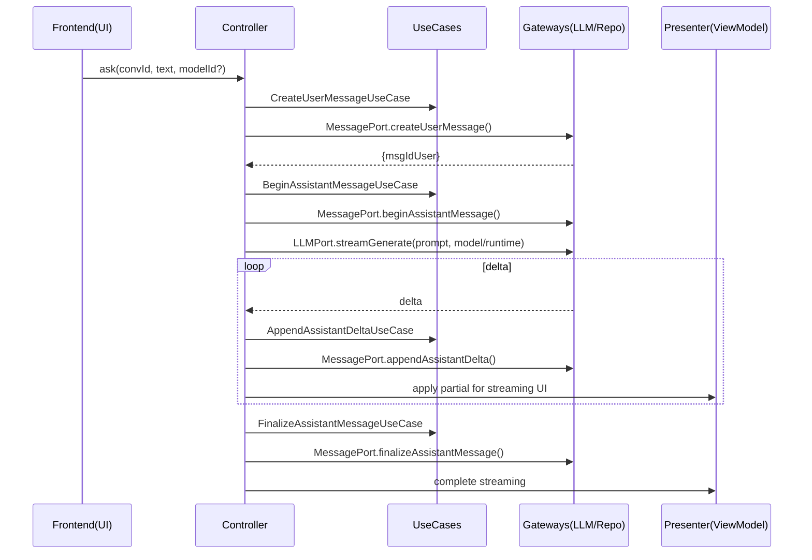

以下は、これまでのエンティティ/アーキテクチャ整理に基づき、**TypeScript + Next.js 実装前提の Use Case 仕様書（Markdown）**です。Clean Architecture の責務分離・依存方向を明示し、コントローラ／プレゼンター／ゲートウェイとの接点、入出力型、正常系/例外系フロー、テスト観点まで一括で参照できるようにまとめています。

---

# Use Case 仕様書（for TypeScript + Next.js）

## 0) 前提と設計方針

- 依存方向は **UI → Interface Adapters → Application(Use Cases) → Domain**。Use Case は**純粋関数**であり、副作用は行わない。
- 外部 API/DB/ブラウザ API 等の副作用は **Gateway** に隔離し、Presenter/Controller と連携する。
- 共通の型は `@/type/**` に集約し、レイヤー間の**契約**として扱う（パスは `@/*` エイリアス）。
- Controller は Use Case の橋渡しと最小状態管理に限定し、副作用は持たない。Presenter は派生値・UI 制御フラグのみを計算し、純粋フックとして実装する。
- 失敗は境界ごとに扱い、Gateway で外部失敗を捕捉・ロギング、Presenter が UI 再試行を提示する。

---

## 1) 用語と命名

- Use Case 名は `verbThingUseCase` を基本とする（例：`createUserMessageUseCase`、`listConversationMessagesUseCase`）。
- システム内部ストリーミング補助は、明確に別ユースケース（Begin/Append/Finalize）として分割する。

---

## 2) アクター別ユースケース一覧

### 2.1 新入社員（ユーザー起点）

| UseCase                               | 目的                            | 主入力                                | 主出力                   | 参照 Port            |
| ------------------------------------- | ------------------------------- | ------------------------------------- | ------------------------ | -------------------- |
| **CreateUserMessageUseCase**          | 会話へ NEW_HIRE メッセージ保存  | `convId`, `content`                   | `{ msgId }`              | `MessagePort`        |
| **BuildPromptForConversationUseCase** | 会話履歴から LLM プロンプト生成 | `convId`, `question`, `historyWindow` | `Prompt`                 | （任意）`PolicyPort` |
| **StreamAssistantAnswerUseCase**      | LLM へ依頼しデルタ受信          | `prompt`, `modelRef`                  | `AsyncIterable<delta>`   | `LLMPort`            |
| **ListConversationMessagesUseCase**   | メッセージ一覧（ページング）    | `convId`, `cursor?`, `limit?`         | `{ items, nextCursor? }` | `MessagePort`        |
| **ListMessageFeedbacksUseCase**       | 指定メッセージの FB 一覧        | `msgId`, `cursor?`, `limit?`          | `{ items, nextCursor? }` | `FeedbackPort`       |

### 2.2 システム（ストリーミング補助）

| UseCase                             | 目的                                    | 主入力                    | 主出力         | 参照 Port     |
| ----------------------------------- | --------------------------------------- | ------------------------- | -------------- | ------------- |
| **BeginAssistantMessageUseCase**    | ASSISTANT メッセージ下書き作成（DRAFT） | `convId`                  | `{ msgId }`    | `MessagePort` |
| **AppendAssistantDeltaUseCase**     | 受信デルタの部分反映（PARTIAL）         | `msgId`, `delta`, `seqNo` | `{ ok: true }` | `MessagePort` |
| **FinalizeAssistantMessageUseCase** | 最終テキスト確定（DONE）                | `msgId`, `finalText`      | `{ ok: true }` | `MessagePort` |

### 2.3 メンター（ユーザー起点）

| UseCase                          | 目的                                   | 主入力                               | 主出力                   | 参照 Port                           |
| -------------------------------- | -------------------------------------- | ------------------------------------ | ------------------------ | ----------------------------------- |
| **ValidateFeedbackRulesUseCase** | 対象・権限・形式検証（ASSISTANT 限定） | `targetMsgId`, `authorId`, `content` | `ValidatedFeedback`      | `MessagePort`, （任意）`PolicyPort` |
| **CreateFeedbackUseCase**        | 検証済み FB を保存                     | `targetMsgId`, `authorId`, `content` | `{ fbId }`               | `FeedbackPort`                      |
| **ListMessageFeedbacksUseCase**  | FB 一覧取得                            | `msgId`, `cursor?`, `limit?`         | `{ items, nextCursor? }` | `FeedbackPort`                      |

> Use Case は純粋関数で「状態決定」を行い、実際の永続化/呼び出しは IA 側（Controller→Gateway 経由）で実施する方針。

---

## 3) 共通インターフェース（Ports、型）

```ts
// @/application/ports.ts
export interface MessagePort {
  createUserMessage(
    convId: string,
    content: string
  ): Promise<{ msgId: string }>;
  beginAssistantMessage(convId: string): Promise<{ msgId: string }>;
  appendAssistantDelta(
    msgId: string,
    delta: string,
    seqNo: number
  ): Promise<void>;
  finalizeAssistantMessage(msgId: string, finalText: string): Promise<void>;
  listConversationMessages(
    convId: string,
    cursor?: string,
    limit?: number
  ): Promise<{ items: Message[]; nextCursor?: string }>;
}
export interface FeedbackPort {
  createFeedback(input: {
    targetMsgId: string;
    authorId: string;
    content: string;
  }): Promise<{ fbId: string }>;
  listFeedbacks(
    msgId: string,
    cursor?: string,
    limit?: number
  ): Promise<{ items: Feedback[]; nextCursor?: string }>;
}
export interface LLMPort {
  streamGenerate(args: {
    prompt: any;
    model: { name: string; params?: Record<string, unknown> };
    runtime: LLMRuntime;
  }): AsyncIterable<string>;
}
export interface PolicyPort {
  isOwner(userId: string, convId: string): Promise<boolean>;
  isMentorMapped(mentorId: string, newhireId: string): Promise<boolean>;
  canCreateFeedback(authorId: string, targetMsgId: string): Promise<boolean>;
}
```

> Ports は **Domain/Application の契約**。Gateway はその実装（Prisma/外部 API/ブラウザ API）として副作用を内包し、ライフサイクル管理と例外処理を責務とする。

---

## 4) 主要 Use Case 詳細仕様

### 4.1 CreateUserMessageUseCase

- **目的**：NEW_HIRE の質問本文を会話へ保存する。
- **アクター**：新入社員（NEW_HIRE）。
- **事前条件**：

  - `isOwner(currentUserId, convId) === true`（PolicyPort で確認）。
  - User が `disabledAt` でない（活性ユーザー）。

- **入力**：`convId: string`, `content: string (1..4000)`
- **出力**：`{ msgId: string }`
- **正常フロー**：

  1. 入力検証（長さ/禁止語）。
  2. 状態決定（Use Case）→ `READY_TO_PERSIST`。
  3. Controller が `MessagePort.createUserMessage` を呼び出し `msgId` を受領。
  4. Presenter が ViewModel を更新（最新メッセージ表示）。

- **代替/例外**：

  - 所有者でない → `Forbidden`。
  - 入力不正 → `ValidationError`。
  - Repo 障害 → Presenter が再試行 UI を提示（Gateway がログ出力）。

- **性能/ページング**：不要。
- **テスト観点**：入力境界（0/最大長）、権限、例外伝播。

### 4.2 BuildPromptForConversationUseCase

- **目的**：質問＋会話履歴から安全な LLM プロンプトを構築。
- **アクター**：新入社員（UI 起点）。
- **事前条件**：`isOwner` が真。
- **入力**：`convId`, `question`, `historyWindow`。
- **出力**：`Prompt`（`system`/`messages[]` 等）。
- **ポイント**：Use Case は**純粋に構築**のみ。トークン制御・安全化はドメイン/ユーティリティに委譲。

### 4.3 StreamAssistantAnswerUseCase

- **目的**：LLM へ生成を依頼し、**デルタ**を順次受信。
- **アクター**：新入社員（UI 起点）
- **事前条件**：所有者検証済み。
- **入力**：`prompt`, `modelRef(modelId など)`
- **出力**：`AsyncIterable<string>`（delta）
- **連携**：

  - Controller は実行前に **Begin→Append→Finalize** の内部 Use Case を呼び出す設計（下記）。
  - Gateway が LLM ストリームを購読し、**例外・キャンセル**を責務内で処理。

- **テスト**：デルタ順序／キャンセル時の後片付け／部分保存の一貫性。

### 4.4 Begin / Append / Finalize（内部補助）

- **BeginAssistantMessageUseCase**：`convId → msgId(DRAFT)` を確保。
- **AppendAssistantDeltaUseCase**：`(msgId, delta, seqNo)` を **PARTIAL** に反映（順序/冪等性）。
- **FinalizeAssistantMessageUseCase**：`finalText` を確定し **DONE**。
- **注意**：Use Case 自体は「状態決定」のみ。実際の upsert/append は **MessagePort** 経由で IA が担う。
- **信頼性**：`(msgId, seqNo)` ユニーク、再送を無害化。中断で **CANCELLED** 遷移あり。

### 4.5 ListConversationMessagesUseCase

- **目的**：会話のメッセージ一覧（ページング）。
- **入力**：`convId`, `cursor?`, `limit?`
- **出力**：`{ items: Message[], nextCursor?: string }`
- **並び**：`createdAt, msgId` の安定ソート。
- **権限**：所有者 or 担当メンターのみ。
- **テスト**：安定ページング、境界（末尾/空）。

### 4.6 ValidateFeedbackRulesUseCase / CreateFeedbackUseCase / ListMessageFeedbacksUseCase

- **Validate**：対象メッセージが `ASSISTANT` か、`isMentorMapped(mentorId, newhireId)` が真か、内容長/禁則を満たすか。
- **Create**：検証済み入力を保存し `fbId` を返す。
- **List**：対象 `msgId` の FB を時刻降順でページング取得。
- **権限**：NEW_HIRE は自会話の閲覧、MENTOR は担当範囲のみ。
- **失敗**：`InvalidTarget` / `Forbidden` / `InvalidContent` / `RepoError` を区分し、Presenter がエラー表示＋再試行ハンドラを提供。

---

## 5) シーケンス（代表例）

### 5.1 新入社員：質問 → LLM ストリーム → 保存



- Gateway はストリーム・例外・キャンセルを責任範囲で処理（進行中フラグ、リソース解放）。
- Presenter は **副作用を持たず**、受信データから派生値/フラグを計算して View へ渡す。

---

## 6) TypeScript 仕様（関数シグネチャ例）

```ts
// 新入社員系
export function createUserMessageUseCase(args: {
  convId: string;
  content: string;
}): { kind: "READY_TO_PERSIST"; convId: string; content: string };
export function buildPromptForConversationUseCase(args: {
  convId: string;
  question: string;
  historyWindow: number;
}): Prompt;
export function streamAssistantAnswerUseCase(args: {
  prompt: Prompt;
  modelId?: string;
}): AsyncIterable<string>;

// ストリーミング補助
export function beginAssistantMessageUseCase(args: { convId: string }): {
  kind: "BEGIN";
  convId: string;
};
export function appendAssistantDeltaUseCase(
  state: Message,
  delta: { text: string; seqNo: number }
): Message;
export function finalizeAssistantMessageUseCase(
  state: Message,
  finalText: string
): Message;

// メンター系
export function validateFeedbackRulesUseCase(args: {
  targetMsgId: string;
  authorId: string;
  content: string;
}): ValidatedFeedback | ValidationError;
export function createFeedbackUseCase(args: { validated: ValidatedFeedback }): {
  fbId: string;
};

// 一覧取得
export function listConversationMessagesUseCase(args: {
  convId: string;
  cursor?: string;
  limit?: number;
}): QuerySpec;
export function listMessageFeedbacksUseCase(args: {
  msgId: string;
  cursor?: string;
  limit?: number;
}): QuerySpec;
```

> Use Case は **永続化そのものは行わず**、Controller が `Port` を通じて実施する。これにより Application/Domain の純粋性が保たれる。

---

## 7) Interface Adapters 連携（Next.js 実装勘所）

- **Controller**：`useXxxController` として Use Case の戻り値を受け、最小限の UI 状態を保持（副作用なし）。
- **Presenter**：`useXxxPresenter` として派生値を計算し `useMemo` でキャッシュ（純粋）。
- **UI Event Adapter**：Pointer/Keyboard/Mouse を座標や意味のある入力に正規化。
- **Gateway**：LLM ストリーム、Blob/Canvas、DB/HTTP を抽象化。進行中フラグ・例外・リソース解放を内包。
- **Presenter がページへ結線**：Presenter は Controller/Presenter/Gateway/Adapter を束ね、View に Props として渡す。

---

## 8) 失敗モードとハンドリング

| 失敗種別       | 例                            | 扱い                                       |
| -------------- | ----------------------------- | ------------------------------------------ |
| バリデーション | 質問が空、FB 文字数超過       | Use Case が早期失敗を返し Presenter が表示 |
| 権限           | 所有者でない、担当外メンター  | `Forbidden` へ正規化し UI 通知             |
| 外部サービス   | LLM タイムアウト、DB 書込失敗 | Gateway で捕捉・ロギング・再試行導線       |
| 想定外         | Null 参照等                   | ErrorBoundary + 監視（Sentry 等）          |

---

## 9) テスト戦略（最低限の観点）

- **Use Case（純粋）**：テーブル駆動で境界/異常系を網羅（例：Append の順不同入力は拒否）。
- **Controller**：操作ごとの状態遷移（renderHook）と副作用不在の確認。
- **Presenter**：派生値・フラグの正しさ、`useMemo` 依存更新条件。
- **Gateway**：ストリーム中断時の後片付け、リトライ UI 連携、ログ出力。

---

## 10) 実装チェックリスト

1. 依存方向（UI→IA→UseCase→Domain）を厳守
2. Use Case は純粋関数（`Date`/`Math.random`/副作用禁止）
3. Gateway に副作用を隔離（進行中フラグ・クリーンアップ・例外あり）
4. Controller は最小状態、Presenter は派生値のみ
5. 型は `@/type/**` に集約、`@/*` エイリアスで import
6. 失敗は区分して UI へ（再試行/通知）
7. ストリーミングは **Begin/Append/Finalize** を分離し、順序・冪等性を担保

---

### 付録：小さな実装スケッチ（純粋ロジック）

```ts
// Append: 状態遷移の純粋ロジック例
export function appendAssistantDeltaUseCase(
  prev: Message,
  delta: { text: string; seqNo: number }
) {
  if (prev.role !== "ASSISTANT") return prev;
  if (prev.status === "DRAFT")
    return { ...prev, status: "PARTIAL", content: delta.text };
  if (prev.status === "PARTIAL")
    return { ...prev, content: prev.content + delta.text };
  return prev;
}

// List: クエリ仕様を返す（永続化は Port 側）
export function listConversationMessagesUseCase(args: {
  convId: string;
  cursor?: string;
  limit?: number;
}) {
  const take = Math.min(Math.max(args.limit ?? 20, 1), 100);
  return { convId: args.convId, cursor: args.cursor, limit: take } as const;
}
```

---

これで、**Use Case（純粋なアプリケーションロジック）**の仕様が、Next.js の **Controller / Presenter / Gateway / View** と噛み合う形で一望できます。
そのまま雛形として `@/application/**` に配置し、Ports 実装（Prisma/LLM/Gateway）と結線していけば、規約どおりのクリーンな実装が進められます。
